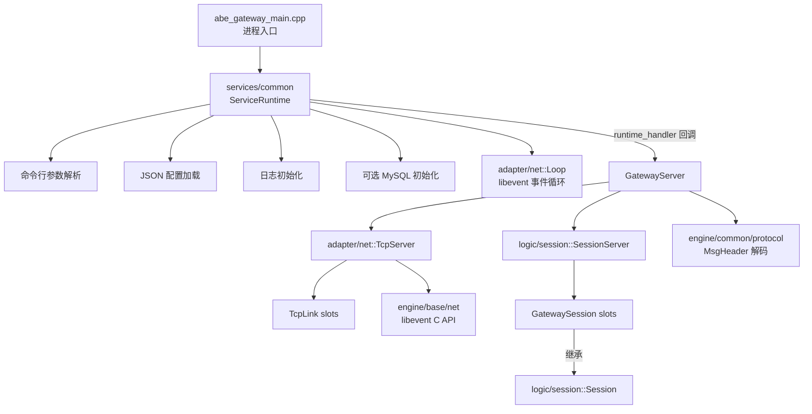
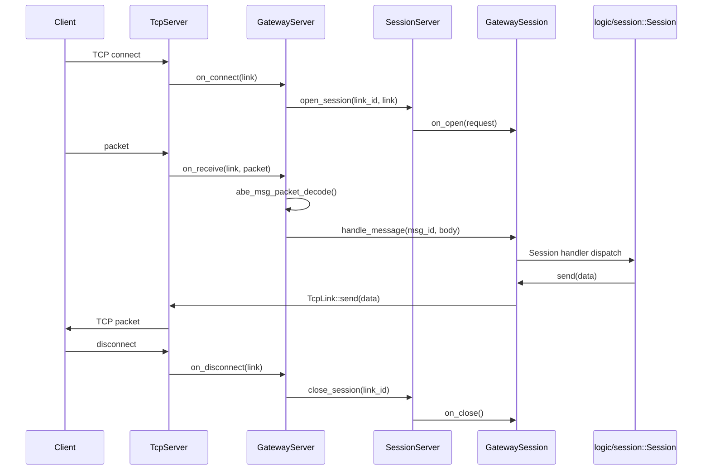

```mermaid
flowchart TD
    Main[abe_gateway_main.cpp<br/>进程入口] --> Runtime[services/common<br/>ServiceRuntime]

    Runtime --> Args[命令行参数解析]
    Runtime --> Config[JSON 配置加载]
    Runtime --> Log[日志初始化]
    Runtime --> DB[可选 MySQL 初始化]
    Runtime --> Loop[adapter/net::Loop<br/>libevent 事件循环]

    Runtime -- runtime_handler 回调 --> GatewayServer[GatewayServer]

    GatewayServer --> TcpServer[adapter/net::TcpServer]
    TcpServer --> TcpLink[TcpLink slots]
    TcpServer --> BaseNet[engine/base/net<br/>libevent C API]

    GatewayServer --> SessionServer[logic/session::SessionServer]
    SessionServer --> GatewaySession[GatewaySession slots]
    GatewaySession -- 继承 --> Session[logic/session::Session]

    GatewayServer --> Protocol[engine/common/protocol<br/>MsgHeader 解码]
```

```mermaid
sequenceDiagram
    participant Client
    participant TcpServer
    participant GatewayServer
    participant SessionServer
    participant GatewaySession
    participant LogicSession as logic/session::Session

    Client->>TcpServer: TCP connect
    TcpServer->>GatewayServer: on_connect(link)
    GatewayServer->>SessionServer: open_session(link_id, link)
    SessionServer->>GatewaySession: on_open(request)

    Client->>TcpServer: packet
    TcpServer->>GatewayServer: on_receive(link, packet)
    GatewayServer->>GatewayServer: abe_msg_packet_decode()
    GatewayServer->>GatewaySession: handle_message(msg_id, body)
    GatewaySession->>LogicSession: Session handler dispatch

    LogicSession->>GatewaySession: send(data)
    GatewaySession->>TcpServer: TcpLink::send(data)
    TcpServer->>Client: TCP packet

    Client->>TcpServer: disconnect
    TcpServer->>GatewayServer: on_disconnect(link)
    GatewayServer->>SessionServer: close_session(link_id)
    SessionServer->>GatewaySession: on_close()
```

还有几个问题
1.使用雪花生成全区全服的唯一id
2.还有user_data改名player_data,因为user和account是平级关系，容易混淆
3.mysql和redis的异步访问