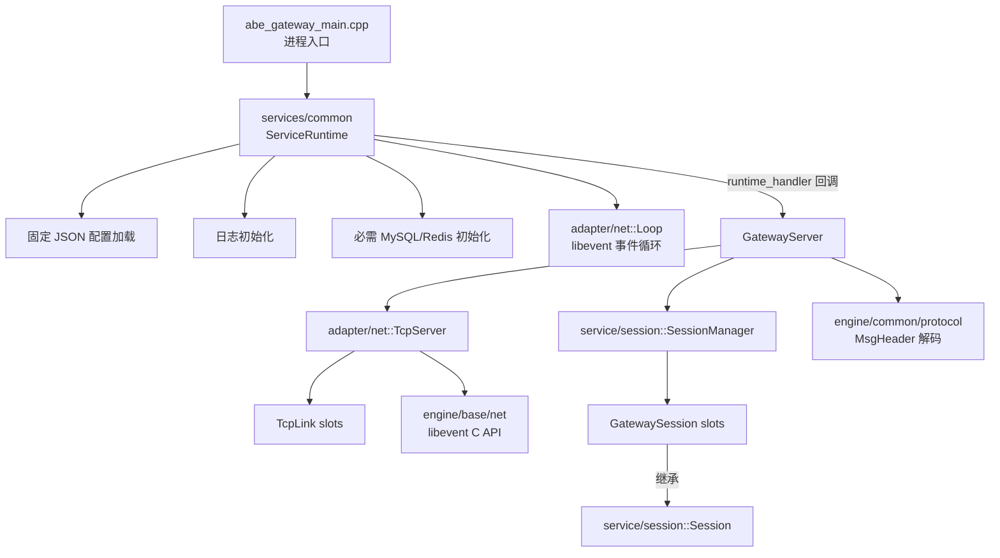
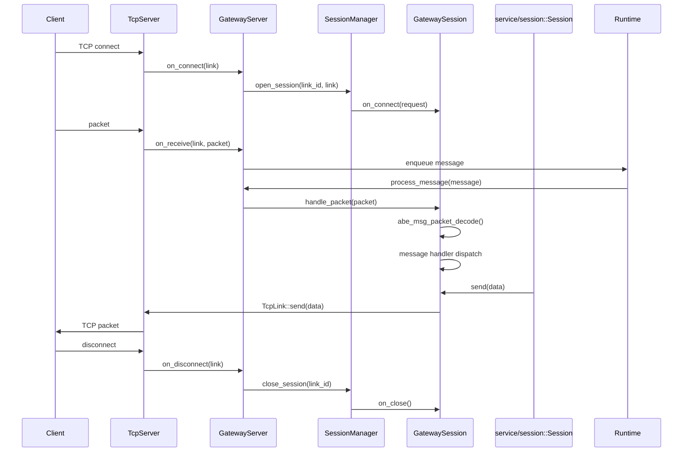

```mermaid
flowchart TD
    Main[abe_gateway_main.cpp<br/>进程入口] --> Runtime[services/common<br/>ServiceRuntime]

    Runtime --> Config[固定 JSON 配置加载]
    Runtime --> Log[日志初始化]
    Runtime --> DB[必需 MySQL/Redis 初始化]
    Runtime --> Loop[adapter/net::Loop<br/>libevent 事件循环]

    Runtime -- runtime_handler 回调 --> GatewayServer[GatewayServer]

    GatewayServer --> TcpServer[adapter/net::TcpServer]
    TcpServer --> TcpLink[TcpLink slots]
    TcpServer --> BaseNet[engine/base/net<br/>libevent C API]

    GatewayServer --> SessionManager[service/session::SessionManager]
    SessionManager --> GatewaySession[GatewaySession slots]
    GatewaySession -- 继承 --> Session[service/session::Session]

    GatewayServer --> Protocol[engine/common/protocol<br/>MsgHeader 解码]
```

```mermaid
sequenceDiagram
    participant Client
    participant TcpServer
    participant GatewayServer
    participant SessionManager
    participant GatewaySession
    participant ServiceSession as service/session::Session

    Client->>TcpServer: TCP connect
    TcpServer->>GatewayServer: on_connect(link)
    GatewayServer->>SessionManager: open_session(link_id, link)
    SessionManager->>GatewaySession: on_connect(request)

    Client->>TcpServer: packet
    TcpServer->>GatewayServer: on_receive(link, packet)
    GatewayServer->>Runtime: enqueue message
    Runtime->>GatewayServer: process_message(message)
    GatewayServer->>GatewaySession: handle_packet(packet)
    GatewaySession->>GatewaySession: abe_msg_packet_decode()
    GatewaySession->>GatewaySession: message handler dispatch

    ServiceSession->>GatewaySession: send(data)
    GatewaySession->>TcpServer: TcpLink::send(data)
    TcpServer->>Client: TCP packet

    Client->>TcpServer: disconnect
    TcpServer->>GatewayServer: on_disconnect(link)
    GatewayServer->>SessionManager: close_session(link_id)
    SessionManager->>GatewaySession: on_close()
```

还有几个问题
1.使用雪花生成全区全服的唯一id
2.login 业务侧已拆分 account_data 和 player_data；底层通用 callback 的 void* user_data 按 C API 约定保留
3.mysql和redis的异步访问
